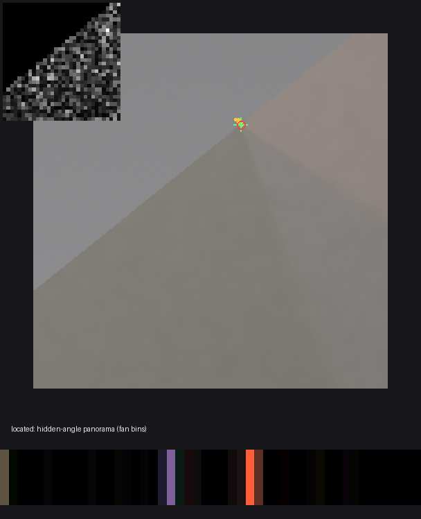

# SighExtraImage — Claude (Opus 5.5) version

This is a fork of [anttiluode/SighExtraImage](https://github.com/anttiluode/SighExtraImage) (imported at `099d605`). It asks one more question of the photo: **before using the boundary light, does the photo actually tell us the corner geometry?** The idea comes from [Varjoluotain](https://github.com/anttiluode/Varjoluotain)'s occluder funnel: treat each geometry as a hypothesis, refute what the photo rules out, and pay for detail only where it can't decide.

## Gate 4 — certify before claiming

Gate 3 sometimes called a fragment of a long valley a "point". Gate 4 checks before claiming: it probes around the best fit, finds the 1–2 px wide valley that a single shadow edge leaves, and walks along it. The corner is reported as a point only if nothing else survives. Write-up: [`results/gate4-v0.md`](results/gate4-v0.md).

- **Two-edge scenes:** 6/6 located within 8 px. Across all 48 signal scenes, 9 of 10 located verdicts are within 7.6 px.
- **Low-signal sweeps:** 0 confident errors in 32 scenes (Gate 3: 4).
- **No false alarms:** 0/16.
- **Fails on one scene (seed 179):** a single edge, fitted at the far end of its own line with the side flipped, 348 px off. That fit explains the light by cancelling contributions 36× larger than the data; every correct located fit stays below 0.9×. That ratio is the next gate's hypothesis.

---

## Gate 3 — locating the corner from the light on the floor



Gate 2 showed that a 1-D boundary strip can't decide the corner geometry. Gate 3 moves to 2-D. On the floor beside a wall edge, light from the hidden side forms a fan of rays from the corner (the corner camera, Bouman et al. 2017). A camera maps the floor to the image by a homography, which keeps lines straight. So the rays stay lines through one image point, and the corner is found by a 2-parameter funnel **with no camera calibration**. `sighextraimage fan photo.jpg --report out.png` runs it on a photo.

**Result: fails on 2 of 5 preregistered criteria; the core works.** Write-up: [`results/gate3-v0.md`](results/gate3-v0.md).

- **Located when the photo can decide it.** With two or more distinct shadow edges, the corner was located within 8 px in 6/7 held-out scenes (median 5.1 px on 256 px), with the hidden side right in 8/8 located verdicts.
- **No false alarms:** 0/16 empty scenes.
- **The hidden scene comes back as a hidden-angle panorama** (the coloured bins in the strip above).
- **Fails 1:** with one shadow edge, the corner is only on a line. The reported line was within 16 px of the corner in only 3/9 scenes.
- **Fails 2:** two single-edge scenes were confidently wrong (238–282 px), one from search pruning and one from the radial model. The fix is to certify a "located" verdict by probing before claiming it.

---

**Gate 2 result: fails narrowly** (2 of 4 preregistered criteria). Full write-up: [`results/gate2-v0.md`](results/gate2-v0.md).

What this version established:

1. **The v0 ESS collapse was a unit bug.** The affine residual is a fraction of variance, but it was divided by 2·σ² with σ = 0.01 intensity. Fixing it with noise measured from the photo (split-half rows), a Birge-ratio temperature and exact importance weights takes median ESS from **1.0 → 48** on held-out scenes.
2. **The Gate 0 "mirrored wrong physics" control was a relabeling.** `WrongCornerTransport` at θ predicts exactly what `CornerTransport` predicts at 1.30 − θ (difference 4e-7). No data can prefer either, so "correct beats mirrored" measured the labeling convention, not evidence (`test_mirrored_transport_is_a_relabeling_of_theta`).
3. **One boundary photo does not decide the corner geometry.** On 16/16 held-out scenes the funnel refutes a median 3.6% of the search box, and it never refutes the reversed edge. A 1-D penumbra profile is a cumulative integral of the hidden radiance, so remapping the strip's angle axis is absorbed by the radiance.
4. **What the photo does decide is whether there is a corner signal at all.** It detected 16/16 signal scenes and correctly passed 14/16 null scenes; the two false alarms are just over threshold.
5. **Assuming a geometry is the dangerous step.** With the default geometry the 90% interval covers the true hidden angle **2/16** times. Marginalising over a geometry prior gives 11/16 (gate needed 12) and the oracle geometry gives 14/16. The misses trace to the sampler collapsing onto one geometry mode, not to the likelihood.

What changed in the code:

- `geometry_funnel.py`: hypotheses, NNLS refutation, the funnel, split-half noise, the calibrated posterior.
- `gate2.py`: the preregistered benchmark (`sighextraimage gate2`).
- `sighextraimage funnel photo.jpg`: prints what a real photo's boundary decides.
- **Photo mode:** `inspect_photo` reports the geometry verdict. Light-guided outpainting is now **refused** when the boundary has no signal or no corner geometry fits it. When the geometry is undecided, it runs with a warning that the placement of hidden light along the extension is an assumption.

The protocol was committed before the held-out run: [`docs/superpowers/specs/2026-10-03-gate2-geometry-funnel-design.md`](docs/superpowers/specs/2026-10-03-gate2-geometry-funnel-design.md).

Related work: the corner camera (Bouman et al., ICCV 2017) and 2-D single-edge reconstruction ([Seidel et al.](https://arxiv.org/abs/2006.09241)) take the corner's location as known and compute each floor pixel's angle from it. [SLD-Net](https://cvpr.thecvf.com/virtual/2026/poster/36296) (CVPR 2026) fuses a precision-weighted likelihood with a diffusion prior. All three agree with result 3: the geometry has to come from image geometry, not from the light. The real Varjoluotain analogue would locate the apex of the 2-D penumbra fan, which this renderer, collapsing rows, cannot represent.

Known issue: `tests/test_inversion.py::test_tv_inversion_recovers_coarse_corner_angle_better_than_no_occluder` also fails on the unmodified upstream code under torch 2.14. It is a threshold that depends on numerics and is unrelated to this work.

---

*Original README follows.*

# SighExtraImage

First. Some serious attempts at this: 

https://openaccess.thecvf.com/content/CVPR2026/papers/Zheng_Similarity-Consistent_Likelihood_Diffusion_enables_Hidden_Person_Detection_from_Wall_Reflections_CVPR_2026_paper.pdf

And: 

https://pmc.ncbi.nlm.nih.gov/articles/PMC11479277/pdf/sensors-24-06480.pdf

Then our silliness. 


SighExtraImage asks a narrow computational-imaging question:

> Can weak light observed near an image boundary reduce uncertainty about what lies outside the frame?

It separates **physical evidence** from **generative plausibility**. Gates 0–1 intentionally use no pretrained diffusion model.

## Gates 0–1 v0 preregistered run

Frozen before the first multi-seed scientific receipt:

- seeds: `3, 7, 11, 19, 23, 29, 31, 37`
- candidate hypotheses per scene: `2500`
- oracle likelihood noise scale: `sigma = 0.01`
- synthetic extracted-signal likelihood: `affine` (shared gain + per-channel offsets)
- scene: `72 x 96` visible crop with `64` hidden pixels
- transport: `64` boundary samples, `64` hidden angular bins, soft corner occluder
- controls: mirrored wrong physics + no-occluder rank-poor transport + uniform prior
- TV inversion: `lambda_tv=0.015`, `300` optimization steps, L2 oracle residual
- Gate 1 initialization: theta offset by `0.28` (other continuous attributes held at truth)
- Gate 1 normalized step size: `0.12`
- Gate 1 controls: mirrored wrong physics, no-occluder physics, norm-matched random direction
- pixel extractor: linearized RGB, geometric row aggregation, smooth profile, low-quantile DC removal

Run:

```bash
sighextraimage benchmark \
  --seeds 3 7 11 19 23 29 31 37 \
  --candidates 2500 \
  --sigma 0.01 \
  --residual-mode affine \
  --tv-iters 300 \
  --output results/receipts/gates-0-1-v0.json
```

## Claim boundary

A positive synthetic result means only that the declared transport contains recoverable information and that the declared likelihood can exploit it. It does **not** mean an arbitrary photograph uniquely reveals the real scene outside its borders.

The real-photo GUI provides **boundary evidence inspection and image outpainting**. The generated extension is a hypothesis about the unseen region. Experimental light guidance can constrain coarse brightness/color structure under the assumed corner geometry; it is not a calibrated hidden-scene reconstruction.

## Gates 0–1 v0 result

Receipt: `results/receipts/gates-0-1-v0.json`

### Gate 0 — oracle boundary measurement: **passes narrowly**

Across the eight preregistered seeds:

- median prior theta error: **0.3628 rad**
- median correct-physics theta error: **0.06655 rad**
- median mirrored-wrong theta error: **0.5899 rad**
- median no-occluder theta error: **0.3886 rad**
- median correct theta posterior/prior std ratio: **0.7343×**
- median no-occluder std ratio: **1.0658×** (no useful contraction)
- median prior RGB error: **0.3519**
- median correct-physics RGB error: **0.2462**

The correct oracle likelihood therefore reduces median theta error and RGB error relative to the uniform prior, contracts theta uncertainty, and localizes theta much better than the mirrored and no-occluder controls. The effect is not universal: seeds 3, 7 and 23 do not improve theta error over the prior, so the claim is aggregate and attribute-specific rather than scene-universal.

### Physics-only TV baseline

Median angular-centroid error from the TV inversion is **0.08834 rad**. This confirms that the declared corner measurement itself contains coarse angular information before any learned semantic prior is introduced.

### Gate 1 — local likelihood gradient: **passes for the preregistered theta-offset probe**

Mean normalized truth-error reduction after one equal-size step:

- correct physics: **+0.1012** (**8/8** seeds improve)
- mirrored wrong physics: **−0.04490** (**2/8** improve)
- no occluder: **−0.02325** (**0/8** improve)
- norm-matched random direction: **−0.01647** (**2/8** improve)

This supports the narrow claim that, for this synthetic parameterization and theta perturbation, the correct boundary likelihood supplies a locally useful guidance direction.

### Pixel extraction — **measurement shape survives, posterior calibration fails**

The synthetic visible-pixel extractor has median correlation **0.9946** with the oracle boundary profile. That is encouraging for the extraction stage itself.

However, feeding the extracted profile into the preregistered affine posterior with the same `sigma=0.01` collapses the importance weights:

- median correct-physics ESS: **1.0 / 2500**
- median mirrored-wrong ESS: **1.0 / 2500**
- no-occluder ESS: approximately **2500 / 2500**

Therefore the apparently tiny extracted-signal theta errors are **not accepted as a Gate 0 success**. The likelihood scale is not calibrated across the affine normalized residual, and both correct and wrong structured operators become spuriously overconfident. The first receipt is preserved unchanged.

The next scientific fix is not to tune until the answer looks good. It is to define/calibrate an affine-residual temperature independently (for example by synthetic held-out noise/nuisance calibration or target ESS coverage), then rerun that as a new receipt with a new gate name.

## Current conclusion

The v0 bench establishes three things inside its declared synthetic world:

1. structured corner/penumbra light contains recoverable angular information;
2. the no-occluder ablation removes that localization signal;
3. the correct oracle likelihood supplies a truth-directed theta gradient.

It does **not** yet establish calibrated posterior inference from extracted photo pixels. The outpainting feature below is a separate exploratory tool; it does not change this receipt or turn generated details into measured ground truth.

## Local GUI

Install the project in a normal online Python environment with image generation:

```bash
pip install -e '.[outpaint]'
sighextraimage gui
```

The app opens locally in your browser and contains two modes:

- **Synthetic Lab** — shows the controlled hidden truth, visible crop, posterior contraction, TV inversion, and Gate 1 controls. Ground-truth panels are explicitly synthetic-only.
- **Photo Inspector** — upload a JPG/PNG, select an edge and boundary region, inspect the extracted evidence, and click **Generate image extension** to produce a larger photograph outside the selected field of view.

The generation panels compare a **prior-only extension** with an **experimental light-guided extension**. The original photograph is preserved pixel for pixel, and the new region is added on the right, left, top, or bottom without stretching the original. Generated details are speculative.

The first generation downloads `stable-diffusion-v1-5/stable-diffusion-inpainting` from Hugging Face (several GB). The download is cached on disk and the loaded model is reused between clicks. CUDA is used when available, otherwise MPS or CPU; CPU generation may take several minutes. Start with a working resolution of 256 or 384 and fewer sampling steps on a slower machine. Model use is subject to its [CreativeML OpenRAIL-M license](https://huggingface.co/stable-diffusion-v1-5/stable-diffusion-inpainting).

The default checkpoint publishes its safetensors weights with the `fp16` filename variant. The loader explicitly selects that variant, while using float32 computation on CPU/MPS. The checkpoint filename variant is separate from the computation precision and Python version.

**Weak light evidence never blocks ordinary generation.** Flat/nonfinite measurements skip the light update and repeat the prior-only image in the comparison panel, with the reason reported. Experimental guidance uses the existing extractor and transport, keeps only coarse singular modes, requires positive exposure scaling, masks updates to generated pixels, and bounds their energy. These checks do not validate the real room geometry or calibrate a posterior. The same seed and deterministic VAE encoding are used in both runs.

The optional `.[gui]` extra still installs the evidence inspector without downloading or installing the diffusion stack. Its generation button reports the extra needed when invoked.

## Headless generation

```bash
sighextraimage outpaint photo.jpg --output extended.png \
  --edge right --extend 0.45 --steps 30 --seed 42

# Also try the coarse boundary-light constraint, with the default strip selection:
sighextraimage outpaint photo.jpg --output prior.png --guided-output guided.png
```

Use the GUI to choose a meaningful measurement strip. `--max-side`, `--prompt`, and `--model` are available for headless runs. PNG outputs preserve original pixels exactly; the working resolution controls generation cost rather than output resolution.

## Verification

```bash
pip install -e '.[outpaint,test]'
python -m pytest -q
```

Generator integration tests construct small real Diffusers UNet/VAE/text/scheduler components locally, so tests do not download the large checkpoint. They verify both four- and nine-channel UNets, fp16-only checkpoint loading with CPU float32 generation, seeded generation, exact original-pixel preservation, finite bounded light updates, and generation despite weak evidence. These tests establish execution behavior, not full-model image quality.

For weak or flat boundaries it reports:

> No evidence that this selected boundary strongly constrains the unseen region under the current model.
