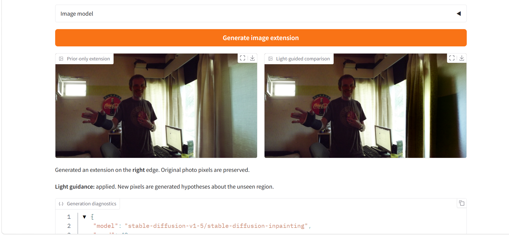

# SighExtraImage

First. Some serious attempts at this: 

https://openaccess.thecvf.com/content/CVPR2026/papers/Zheng_Similarity-Consistent_Likelihood_Diffusion_enables_Hidden_Person_Detection_from_Wall_Reflections_CVPR_2026_paper.pdf

And: 

https://pmc.ncbi.nlm.nih.gov/articles/PMC11479277/pdf/sensors-24-06480.pdf

Then our silliness. 



SighExtraImage asks a narrow computational-imaging question:

> Can weak light observed near an image boundary reduce uncertainty about what lies outside the frame?

It separates **physical evidence** from **generative plausibility**. Gates 0–1 intentionally use no pretrained diffusion model.

## Gates 0–1 v0 preregistered run

Frozen before the first multi-seed scientific receipt:

- seeds: `3, 7, 11, 19, 23, 29, 31, 37`
- candidate hypotheses per scene: `2500`
- oracle likelihood noise scale: `sigma = 0.01`
- synthetic extracted-signal likelihood: `affine` (shared gain + per-channel offsets)
- scene: `72 x 96` visible crop with `64` hidden pixels
- transport: `64` boundary samples, `64` hidden angular bins, soft corner occluder
- controls: mirrored wrong physics + no-occluder rank-poor transport + uniform prior
- TV inversion: `lambda_tv=0.015`, `300` optimization steps, L2 oracle residual
- Gate 1 initialization: theta offset by `0.28` (other continuous attributes held at truth)
- Gate 1 normalized step size: `0.12`
- Gate 1 controls: mirrored wrong physics, no-occluder physics, norm-matched random direction
- pixel extractor: linearized RGB, geometric row aggregation, smooth profile, low-quantile DC removal

Run:

```bash
sighextraimage benchmark \
  --seeds 3 7 11 19 23 29 31 37 \
  --candidates 2500 \
  --sigma 0.01 \
  --residual-mode affine \
  --tv-iters 300 \
  --output results/receipts/gates-0-1-v0.json
```

## Claim boundary

A positive synthetic result means only that the declared transport contains recoverable information and that the declared likelihood can exploit it. It does **not** mean an arbitrary photograph uniquely reveals the real scene outside its borders.

The real-photo GUI provides **boundary evidence inspection and image outpainting**. The generated extension is a hypothesis about the unseen region. Experimental light guidance can constrain coarse brightness/color structure under the assumed corner geometry; it is not a calibrated hidden-scene reconstruction.

## Gates 0–1 v0 result

Receipt: `results/receipts/gates-0-1-v0.json`

### Gate 0 — oracle boundary measurement: **passes narrowly**

Across the eight preregistered seeds:

- median prior theta error: **0.3628 rad**
- median correct-physics theta error: **0.06655 rad**
- median mirrored-wrong theta error: **0.5899 rad**
- median no-occluder theta error: **0.3886 rad**
- median correct theta posterior/prior std ratio: **0.7343×**
- median no-occluder std ratio: **1.0658×** (no useful contraction)
- median prior RGB error: **0.3519**
- median correct-physics RGB error: **0.2462**

The correct oracle likelihood therefore reduces median theta error and RGB error relative to the uniform prior, contracts theta uncertainty, and localizes theta much better than the mirrored and no-occluder controls. The effect is not universal: seeds 3, 7 and 23 do not improve theta error over the prior, so the claim is aggregate and attribute-specific rather than scene-universal.

### Physics-only TV baseline

Median angular-centroid error from the TV inversion is **0.08834 rad**. This confirms that the declared corner measurement itself contains coarse angular information before any learned semantic prior is introduced.

### Gate 1 — local likelihood gradient: **passes for the preregistered theta-offset probe**

Mean normalized truth-error reduction after one equal-size step:

- correct physics: **+0.1012** (**8/8** seeds improve)
- mirrored wrong physics: **−0.04490** (**2/8** improve)
- no occluder: **−0.02325** (**0/8** improve)
- norm-matched random direction: **−0.01647** (**2/8** improve)

This supports the narrow claim that, for this synthetic parameterization and theta perturbation, the correct boundary likelihood supplies a locally useful guidance direction.

### Pixel extraction — **measurement shape survives, posterior calibration fails**

The synthetic visible-pixel extractor has median correlation **0.9946** with the oracle boundary profile. That is encouraging for the extraction stage itself.

However, feeding the extracted profile into the preregistered affine posterior with the same `sigma=0.01` collapses the importance weights:

- median correct-physics ESS: **1.0 / 2500**
- median mirrored-wrong ESS: **1.0 / 2500**
- no-occluder ESS: approximately **2500 / 2500**

Therefore the apparently tiny extracted-signal theta errors are **not accepted as a Gate 0 success**. The likelihood scale is not calibrated across the affine normalized residual, and both correct and wrong structured operators become spuriously overconfident. The first receipt is preserved unchanged.

The next scientific fix is not to tune until the answer looks good. It is to define/calibrate an affine-residual temperature independently (for example by synthetic held-out noise/nuisance calibration or target ESS coverage), then rerun that as a new receipt with a new gate name.

## Current conclusion

The v0 bench establishes three things inside its declared synthetic world:

1. structured corner/penumbra light contains recoverable angular information;
2. the no-occluder ablation removes that localization signal;
3. the correct oracle likelihood supplies a truth-directed theta gradient.

It does **not** yet establish calibrated posterior inference from extracted photo pixels. The outpainting feature below is a separate exploratory tool; it does not change this receipt or turn generated details into measured ground truth.

## Local GUI

Install the project in a normal online Python environment with image generation:

```bash
pip install -e '.[outpaint]'
sighextraimage gui
```

The app opens locally in your browser and contains two modes:

- **Synthetic Lab** — shows the controlled hidden truth, visible crop, posterior contraction, TV inversion, and Gate 1 controls. Ground-truth panels are explicitly synthetic-only.
- **Photo Inspector** — upload a JPG/PNG, select an edge and boundary region, inspect the extracted evidence, and click **Generate image extension** to produce a larger photograph outside the selected field of view.

The generation panels compare a **prior-only extension** with an **experimental light-guided extension**. The original photograph is preserved pixel for pixel, and the new region is added on the right, left, top, or bottom without stretching the original. Generated details are speculative.

The first generation downloads `stable-diffusion-v1-5/stable-diffusion-inpainting` from Hugging Face (several GB). The download is cached on disk and the loaded model is reused between clicks. CUDA is used when available, otherwise MPS or CPU; CPU generation may take several minutes. Start with a working resolution of 256 or 384 and fewer sampling steps on a slower machine. Model use is subject to its [CreativeML OpenRAIL-M license](https://huggingface.co/stable-diffusion-v1-5/stable-diffusion-inpainting).

The default checkpoint publishes its safetensors weights with the `fp16` filename variant. The loader explicitly selects that variant, while using float32 computation on CPU/MPS. The checkpoint filename variant is separate from the computation precision and Python version.

**Weak light evidence never blocks ordinary generation.** Flat/nonfinite measurements skip the light update and repeat the prior-only image in the comparison panel, with the reason reported. Experimental guidance uses the existing extractor and transport, keeps only coarse singular modes, requires positive exposure scaling, masks updates to generated pixels, and bounds their energy. These checks do not validate the real room geometry or calibrate a posterior. The same seed and deterministic VAE encoding are used in both runs.

The optional `.[gui]` extra still installs the evidence inspector without downloading or installing the diffusion stack. Its generation button reports the extra needed when invoked.

## Headless generation

```bash
sighextraimage outpaint photo.jpg --output extended.png \
  --edge right --extend 0.45 --steps 30 --seed 42

# Also try the coarse boundary-light constraint, with the default strip selection:
sighextraimage outpaint photo.jpg --output prior.png --guided-output guided.png
```

Use the GUI to choose a meaningful measurement strip. `--max-side`, `--prompt`, and `--model` are available for headless runs. PNG outputs preserve original pixels exactly; the working resolution controls generation cost rather than output resolution.

## Verification

```bash
pip install -e '.[outpaint,test]'
python -m pytest -q
```

Generator integration tests construct small real Diffusers UNet/VAE/text/scheduler components locally, so tests do not download the large checkpoint. They verify both four- and nine-channel UNets, fp16-only checkpoint loading with CPU float32 generation, seeded generation, exact original-pixel preservation, finite bounded light updates, and generation despite weak evidence. These tests establish execution behavior, not full-model image quality.

For weak or flat boundaries it reports:

> No evidence that this selected boundary strongly constrains the unseen region under the current model.
