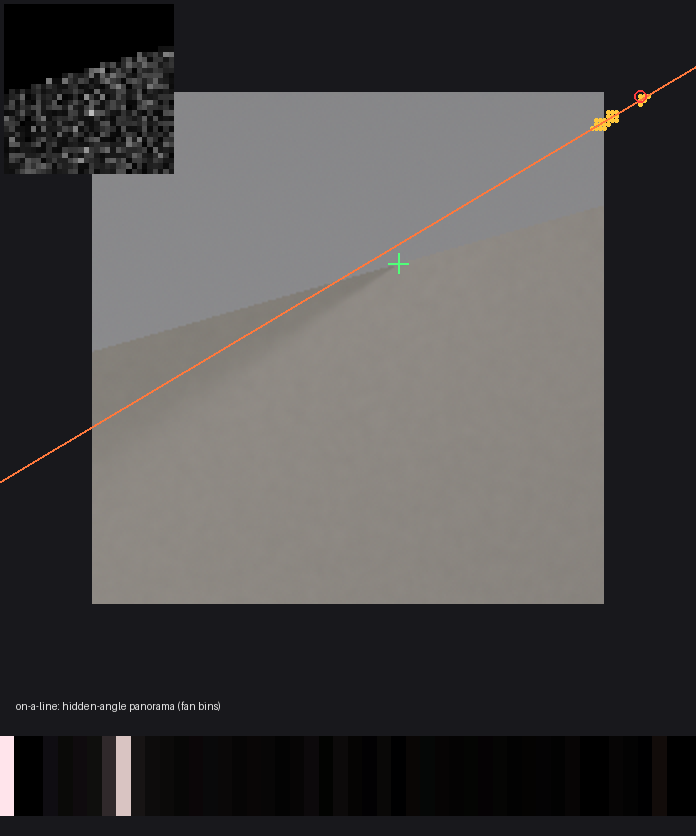

# Gate 3 v0 — locating the wall corner from the 2-D penumbra fan

**Result: Gate 3 fails, on 2 of 5 preregistered criteria. The core idea works.** In the 2-D setting, the photo *decides* the corner when two or more shadow edges are present, which the 1-D strip in Gate 2 could not. Single-edge scenes expose a search weakness that produced two confidently wrong verdicts.

Protocol, committed (e790e2b) before any held-out result: [`docs/superpowers/specs/2026-10-03-gate3-fan-apex-design.md`](../docs/superpowers/specs/2026-10-03-gate3-fan-apex-design.md). Receipt: [`receipts/gate3-v0.json`](receipts/gate3-v0.json). Seeds 41–107: 16 signal scenes (7 with ≥ 2 distinct edges, 9 with one) and 16 null scenes.

| ID | Claim | Observed | Required | |
|---|---|---:|---:|---|
| G3a | No false alarms | 0/16 | ≤ 1 | pass |
| G3b | ≥ 2 distinct edges → corner located within 8 px | 6/7 | ≥ 75% | pass |
| G3c | One edge → corner within 16 px of the reported line | 3/9 | ≥ 75% | **fail** |
| G3d | Hidden side right when located | 8/8 | ≥ 90% | pass |
| G3e | No located verdict > 16 px off | 2 of 8 | 0 | **fail** |

## What works

**The corner is located from floor light alone, with no camera calibration.** In the distinct-edge scenes, errors were 0.4, 1.3, 3.0, 5.1, 6.0 and 7.0 px on a 256 px image (median 5.1). The seventh was honestly reported as `on-a-line`, not as a wrong position. The hidden side was correct in all 8 located verdicts. This is the 2-D analogue of Varjoluotain's plate search: rays from the corner stay lines through one image point under any camera homography, so locating the corner needs only two parameters.

**The bench knows when there is no fan.** All 16 null scenes read `no-signal`. Their largest background excess was 1.95, against a minimum of 10.7 for signal scenes. The threshold of 3.0 was set from development nulls before the run.

**The hidden scene comes back as a panorama.** The fitted angular radiance at the located corner shows the hidden sources' colours and angles. In seed 71, two bins light up purple and orange, the two hidden sources.

*Seed 71. The orange survivors sit on the true corner (green cross), 0.4 px off. Top left: residue map. Bottom: recovered hidden-angle panorama.*

## What fails, and why

**One distinct edge pins the corner only to a line.** This was predicted. The 9 single-edge scenes were reported `on-a-line` 7 times, but the true corner lay within 16 px of the reported line only 3 times.

The cause is visible in the survivors. The true valley is the whole edge line, but the funnel keeps only a short fragment of it, 15–142 px long, so the line's direction is estimated from a fragment.

*Seed 61. The reported line passes 9 px from the true corner, but the surviving fragment (top right) is far along it.*

**Two confidently wrong verdicts (G3e).** Seeds 47 and 89 are single-edge scenes whose fragment happened to be shorter than 16 px, so they were reported as `located`, 282 and 238 px off. The diagnosis splits them:

- **Seed 47 is a search failure.** The true corner is *not* refuted: Δχ² = 7 against a threshold of 12. The coarse level pruned it, and nothing certified that the "located" region was the only one consistent with the photo.
- **Seed 89 is a model failure.** The true corner is refuted, Δχ² ≈ 441 against 36. The model prefers a wrong place along the edge's direction. The cause is not yet identified. The most likely suspect is the two-hat radial term, which is the only part of the model that pins position *along* a single edge.

**Sweep (predicted).** Where the fan structure is at or below the floor texture, localisation fails:

| Setting | Multi-edge scenes located | Confidently wrong verdicts |
|---|---:|---:|
| leak 0.1, texture 0.01 | 0/7 | 3 |
| leak 0.3, texture 0.03 | 0/7 | 1 |

The safety property does not hold there either. That is the same weakness as G3e: a compact survivor cloud is not proof of a unique location.

## Next gate, if pursued (not run)

1. **Certify "located" by probing** (Luotain's rule: pay to check before claiming). Before reporting a corner, evaluate a ring of hypotheses at 32, 64 and 128 px, plus the endpoints of the line through the best fit in both directions. If any survives, the verdict becomes `on-a-line` or `undecided`. This addresses seed 47 and the sweep's confident-wrong cases.
2. **Single-edge position along the line.** Either stop claiming it, reporting only the line, or diagnose the radial term that drives seed 89.
3. **Real photos.** The bench needs a floor photo by a doorway with a bright room beyond. `sighextraimage fan photo.jpg --region …` runs on one now; no real photo has been tested.

## Claim boundary

Synthetic floor, Lambertian corner-camera physics, known floor mask, hidden light at 30% of room light with 1% floor texture. Real floors are often more textured and real hidden scenes dimmer. The sweep shows the method fails silently-to-loudly there until certification is added.
